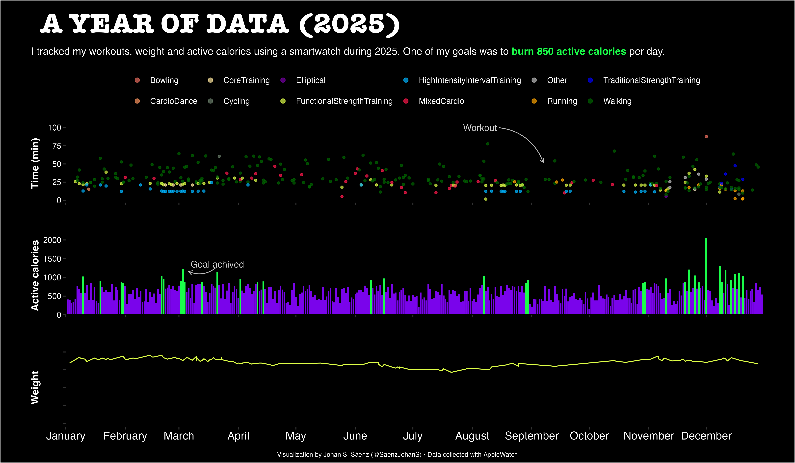

# A YEAR OF DATA

I wear an Apple smart watch almost every day and I am using the collected data to summaries how active I am. I created a workflow in a Rmd file to produce a visualization of my activities during the whole year.

If you want to replicate this figure with your own data, you need to download the files from the Apple health app. You can follow this [tutorial](https://medium.com/macoclock/how-to-export-health-data-from-iphone-60a88cfe1825). Unzip the data and place it in the **rawdata** folder. After that just modify the year that you wish to plot.

### [Workouts 2025](https://github.com/SebasSaenz/workouts/blob/main/code/workouts_2.qmd) Data collected with an Apple Watch

